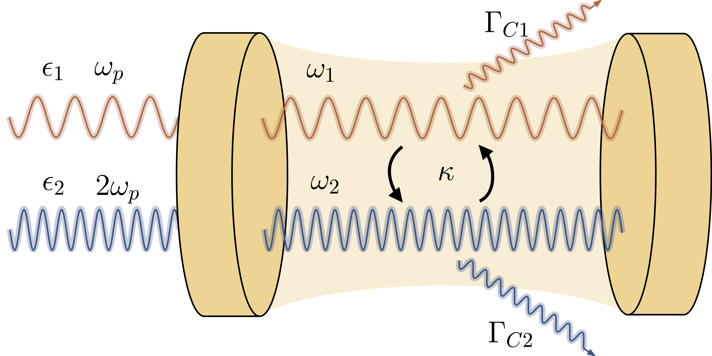

# Non-equilibrium Transitions in Sub/Second Harmonic Generation : Quantum Picture

This study presents a quantum statistical analysis of a non-linear optical system with a mode coupled to its second harmonic. Quantum fluctuations are included via a Fokker-Planck equation for a generalized P representation. This is a short review of previous theoritical study presented by Drummond _et al._ (https://doi.org/10.1080/713820531). 

 

